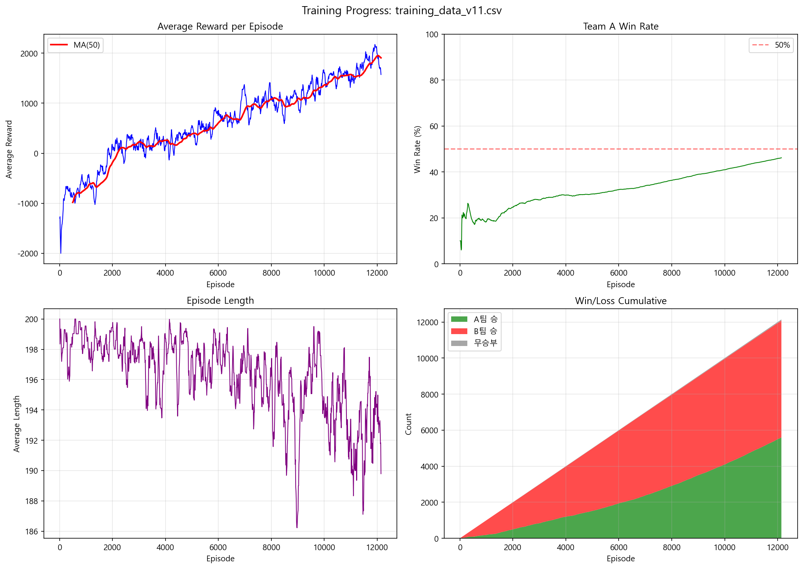

# 강화학습 기반 유저 적응형 협동 전투 NPC

**User-Adaptive Cooperative Combat NPC System Based on Reinforcement Learning**

PPO(Proximal Policy Optimization) 기반의 멀티에이전트 강화학습을 활용하여, 플레이어의 숙련도에 따라 협동 방식을 조절하는 지능형 NPC 시스템입니다.



---

## 목차

- [프로젝트 개요](#프로젝트-개요)
- [시스템 요구사항](#시스템-요구사항)
- [설치 방법](#설치-방법)
- [프로젝트 구조](#프로젝트-구조)
- [사용 방법](#사용-방법)
  - [1단계: Self-Play 학습](#1단계-self-play-학습)
  - [2단계: 협동 NPC 학습](#2단계-협동-npc-학습)
  - [Unity 연동 실행](#unity-연동-실행)
- [환경 설계](#환경-설계)
- [학습 결과](#학습-결과)

---

## 프로젝트 개요

### 문제 정의
- 기존 규칙 기반 AI(Behavior Tree, FSM)는 행동이 예측 가능하여 몰입감 저하
- 다양한 유저 수준에 맞추기 위해 개발자가 규칙을 수동으로 튜닝해야 하는 비효율성
- 플레이어의 스타일이나 숙련도 변화에 실시간 적응 불가

### 해결 방법: 2단계 파이프라인

| 단계 | 설명 | 목표 |
|------|------|------|
| **STEP 1** | Self-Play 학습 | PPO + 파라미터 공유로 양 팀 승률 50:50 균형 AI 생성 |
| **STEP 2** | 협동 NPC 학습 | 플레이어 모델 고정 + 협동 보상 추가로 시너지 극대화 |

---

## 시스템 요구사항

### 하드웨어
- **CPU**: Intel Core i5 이상 권장
- **GPU**: NVIDIA GPU (CUDA 지원) 권장
- **RAM**: 16GB 이상 권장

### 소프트웨어
- **OS**: Windows 10/11
- **Python**: 3.10 이상
- **Unity**: 2022.3 LTS
- **CUDA**: 11.8 이상 (GPU 사용 시)

---

## 설치 방법

### 1. 저장소 클론

```bash
git clone https://github.com/junHyeong7083/rl-multiagent-combat-unity.git
cd rl-multiagent-combat-unity
```

### 2. Python 환경 설정

```bash
cd RL_Game_NPC

# 가상환경 생성 (권장)
python -m venv venv

# 가상환경 활성화
# Windows
venv\Scripts\activate
# Linux/Mac
source venv/bin/activate

# 의존성 설치
pip install -r requirements.txt
```

### 3. PyTorch GPU 버전 설치 (선택)

CUDA GPU를 사용하려면 PyTorch를 별도로 설치합니다:

```bash
# CUDA 11.8 버전
pip install torch --index-url https://download.pytorch.org/whl/cu118

# CUDA 12.1 버전
pip install torch --index-url https://download.pytorch.org/whl/cu121
```

### 4. Unity 프로젝트 열기

1. Unity Hub에서 `rl-multiagent-combat-unity` 폴더를 프로젝트로 추가
2. Unity 2022.3 LTS 버전으로 프로젝트 열기

---

## 프로젝트 구조

```
rl-multiagent-combat-unity/
├── Assets/                     # Unity 프로젝트
│   └── 01_Script/
│       ├── GameViewer3D.cs     # 3D 게임 뷰어
│       ├── UdpReceiver.cs      # Python-Unity UDP 통신
│       ├── PlayerInputSender.cs # 플레이어 입력 전송
│       └── ...
│
├── RL_Game_NPC/                # Python 강화학습 코드
│   ├── src/
│   │   ├── config.py           # 환경 및 학습 설정
│   │   ├── env.py              # 전투 환경 구현
│   │   ├── agent.py            # PPO 에이전트
│   │   ├── unit.py             # 유닛 클래스
│   │   └── game_map.py         # 맵 생성
│   │
│   ├── train.py                # 1단계: Self-Play 학습
│   ├── train_coop_v11.py       # 2단계: 협동 NPC 학습
│   ├── unity_streamer.py       # Unity 연동 (AI vs AI)
│   ├── player_mode_streamer.py # Unity 연동 (Human vs AI)
│   └── requirements.txt
│
└── README.md
```

---

## 사용 방법

### 1단계: Self-Play 학습

양 팀이 동일한 정책으로 대전하며 기본 전투 능력을 학습합니다.

```bash
cd RL_Game_NPC

# 기본 학습 (50만 스텝)
python train.py

# 옵션 지정 학습
python train.py --total-steps 1000000 --batch-size 256 --lr 3e-4

# 모델 이어서 학습
python train.py --load-model models/model_latest.pt
```

**주요 옵션:**
| 옵션 | 기본값 | 설명 |
|------|--------|------|
| `--total-steps` | 500000 | 총 학습 스텝 수 |
| `--batch-size` | 256 | 배치 크기 |
| `--lr` | 3e-4 | 학습률 |
| `--save-dir` | models | 모델 저장 경로 |
| `--save-interval` | 100 | 저장 간격 (에피소드) |
| `--load-model` | None | 이어서 학습할 모델 경로 |

---

### 2단계: 협동 NPC 학습

- **B팀 (적팀)**: 1단계 Self-Play 모델 고정
- **A팀 탱커**: 플레이어 대리 역할 (3가지 정책 중 랜덤 선택으로 다양한 플레이 스타일 시뮬레이션)
  - Goal: 적에게 돌진
  - Model: 1단계 학습된 행동
  - Conditional: 상황에 따라 전환
- **A팀 나머지 4명**: 다양한 탱커 행동에 맞춰 협동하도록 학습

```bash
# 협동 NPC 학습
python train_coop_v11.py

# 1단계 모델로 2단계 학습
python train_coop_v11.py --opponent-model models/model_final.pt
```

**주요 옵션:**
| 옵션 | 기본값 | 설명 |
|------|--------|------|
| `--opponent-model` | models_v11_10k_episodes/model_final.pt | B팀 + 탱크 모델 |
| `--load-model` | None | NPC 시작 모델 (없으면 새로 학습) |
| `--policy-goal` | 0.50 | Goal 정책 비율 (따라가기) |
| `--policy-model` | 0.15 | Model 정책 비율 |
| `--policy-cond` | 0.35 | Conditional 정책 비율 |

---

### Unity 연동 실행

#### AI vs AI 관전 모드

학습된 AI끼리 대전하는 것을 관전합니다.

```bash
# 1. Python 서버 실행
python unity_streamer.py

# 2. Unity 에디터에서 Play 버튼 클릭
# 또는 빌드된 게임 실행
```

#### Human vs AI 플레이어 모드

직접 플레이어로 참여하여 AI와 협동합니다.

```bash
# 1. Python 서버 실행 (역할 선택)
python player_mode_streamer.py --role dealer

# 2. Unity 에디터에서 Play 버튼 클릭
```

**역할 옵션:** `tank`, `dealer`, `healer`, `ranger`, `support`

#### 플레이어 조작법

| 키 | 동작 |
|----|------|
| W | 위로 이동 |
| A | 왼쪽으로 이동 |
| S | 아래로 이동 |
| D | 오른쪽으로 이동 |
| Space | 가장 가까운 적 공격 |
| Q | HP 가장 낮은 적 공격 |
| E | 범위 공격 스킬 (딜러) |
| R | 힐 스킬 (힐러) |

#### 통신 구조

```
┌─────────────────┐         UDP (5005)         ┌─────────────────┐
│                 │ ◄────────────────────────  │                 │
│   Unity Game    │        FrameData JSON      │  Python Server  │
│                 │                            │                 │
│                 │ ────────────────────────►  │                 │
└─────────────────┘         TCP (5006)         └─────────────────┘
                          PlayerInput JSON
```

---

## 환경 설계

### 전투 환경

| 항목 | 값 |
|------|-----|
| 맵 크기 | 20 × 20 격자 |
| 팀 구성 | 5명 vs 5명 |
| 최대 스텝 | 200 |
| 타일 구성 | 벽 10%, 위험 지역 5%, 버프 지역 3% |

### 역할별 스탯

| 역할 | HP | MP | 공격 | 방어 | 사거리 | 고유 스킬 |
|------|-----|-----|------|------|--------|----------|
| 탱커 | 150 | 30 | 10 | 15 | 1 | 도발 |
| 딜러 | 80 | 50 | 25 | 5 | 1 | 범위 공격 |
| 힐러 | 70 | 100 | 8 | 5 | 2 | 치유 |
| 레인저 | 60 | 60 | 20 | 3 | 4 | 관통샷 |
| 서포터 | 90 | 80 | 12 | 8 | 2 | 버프 |

### 행동 공간 (Discrete 12)

| ID | 행동 | 설명 |
|----|------|------|
| 0 | 제자리 대기 | MP 회복 |
| 1-4 | 이동 | 상하좌우 1칸 |
| 5 | 가까운 적 공격 | 기본 공격 |
| 6 | 최저 HP 적 공격 | 마무리용 |
| 7-11 | 역할별 스킬 | 고유 스킬 사용 |

### 관찰 공간 (229차원)

| 구성 요소 | 차원 | 설명 |
|----------|------|------|
| 자기 상태 | 10 | HP, MP, 위치, 생존여부, 역할 |
| 아군 상태 | 40 | 4명 × 10차원 |
| 적군 상태 | 50 | 5명 × 10차원 |
| 지형 정보 | 121 | 11×11 로컬 맵 |
| 전역 정보 | 2 | 현재 턴, 팀 ID |
| 플레이어 정보 | 6 | 협동 대상 정보 (2단계) |

---

## 학습 결과

### 1단계: Self-Play (12,000 에피소드)

| 지표 | 결과 |
|------|------|
| 총 학습 스텝 | 19,936,010 |
| Team A 승률 | 50.2% |
| Team B 승률 | 49.4% |
| 무승부 비율 | 0.4% |
| 평균 FPS | ~905 |
| 총 학습 시간 | 6.1시간 |

### 2단계: 협동 학습 (12,750 에피소드)

| 지표 | 결과 |
|------|------|
| 평균 보상 증가 | -1,297 → +1,739 |
| 평균 탱커 거리 | 10.0 → 2.91 (협동 성공) |
| 최종 승률 균형 | 47:52 |

---

## 기술 스택

- **강화학습**: PPO (Proximal Policy Optimization)
- **프레임워크**: PyTorch 2.0
- **게임 엔진**: Unity 2022.3 LTS
- **통신**: UDP/TCP Socket

---

## 참고 자료

- [PPO 논문](https://arxiv.org/abs/1707.06347)
- [Unity ML-Agents](https://github.com/Unity-Technologies/ml-agents)

---

## 라이선스

이 프로젝트는 교육 및 연구 목적으로 개발되었습니다.

---

## 개발자

- 손승현 (V2024105)
- 박준형 (V2025114)
