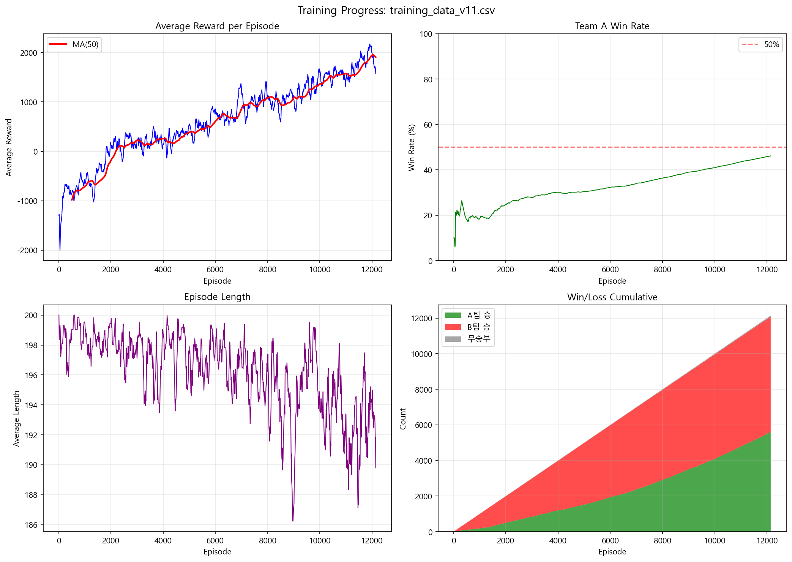
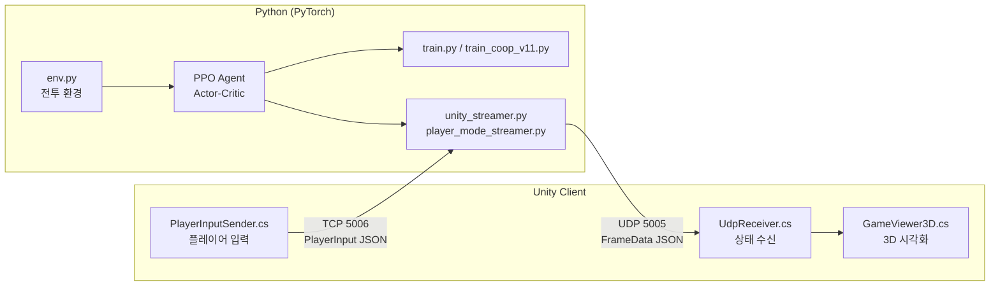
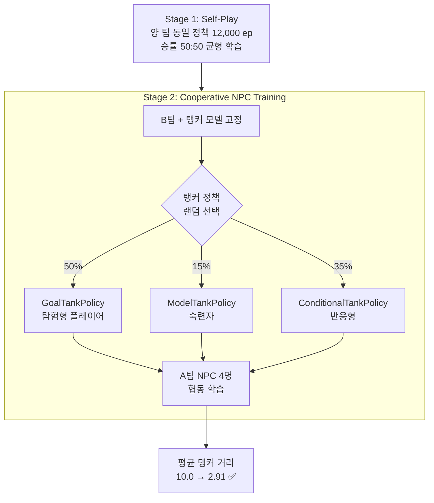

# 강화학습 기반 유저 적응형 협동 전투 NPC
> User-Adaptive Cooperative Combat NPC System Based on Reinforcement Learning
>
> PPO 기반 5vs5 멀티에이전트 강화학습으로, 다양한 플레이어 스타일에 적응하는 협동 NPC를 학습시킨 프로젝트입니다.




---

## 📌 At a Glance

| 항목 | 내용 |
|------|------|
| **기간** | 2025.10 ~ 2025.11 (약 2개월) |
| **팀 구성** | 2인 개발 (AI 학습 1명 + Unity 연동 1명) |
| **본인 역할** | **협동 NPC 학습(Stage 2) · Python-Unity 실시간 연동** |
| **엔진 / 스택** | Unity 2022.3 LTS · Python 3.10 · PyTorch 2.0 · PPO + GAE |
| **플랫폼** | Windows PC |
| **결과** | 협동 NPC 평균 탱커 거리 **71% 감소** (10.0 → 2.91), 약 1ms 지연 실시간 연동 |

---

## ✨ Highlights

- **PPO 기반 5vs5 멀티에이전트 강화학습**: 양 팀이 동일 정책으로 대전하며 균형(50.2 : 49.4) 학습 후, 협동 NPC 학습 단계로 전환하는 **2단계 학습 파이프라인** 구축
- **3가지 플레이어 정책 랜덤 매칭**으로 단일 플레이 스타일 과적합 회피 → 다양한 유저 행동에 적응하는 NPC 학습
- **거리 비례 협동 보상 설계**로 NPC가 플레이어 탱커를 따라다니는 행동을 학습 (평균 탱커 거리 10.0 → 2.91, **71% 감소**)
- **UDP/TCP 분리 통신** (게임 상태 UDP, 입력 TCP)으로 약 **1ms 지연** 실시간 Python ↔ Unity 연동
- **Actor-Critic 네트워크 (229 → 256 → 256 → 12)** PyTorch 직접 구현 및 GAE 기반 어드밴티지 추정

---

## 🎮 Demo

`RL_Game_NPC/training_data_v11_graph.png` — 12,750 에피소드 학습 곡선 (평균 보상 -1,297 → +1,739)

Unity 에디터 또는 빌드 실행 후 [Unity 연동 실행](#unity-연동-실행) 참고.

---

## 🏗 Architecture

전체 시스템은 **Python(강화학습) ↔ Unity(시각화·플레이)** 두 프로세스로 분리되며, UDP/TCP 소켓으로 실시간 통신합니다.


```mermaid
flowchart LR
    subgraph Python["Python (PyTorch)"]
        ENV[env.py<br/>전투 환경] --> AGENT[PPO Agent<br/>Actor-Critic]
        AGENT --> TRAIN[train.py / train_coop_v11.py]
        AGENT --> STREAM[unity_streamer.py<br/>player_mode_streamer.py]
    end

    subgraph Unity["Unity Client"]
        VIEWER[GameViewer3D.cs<br/>3D 시각화]
        INPUT[PlayerInputSender.cs<br/>플레이어 입력]
        RECV[UdpReceiver.cs<br/>상태 수신]
    end

    STREAM -- "UDP 5005<br/>FrameData JSON" --> RECV --> VIEWER
    INPUT -- "TCP 5006<br/>PlayerInput JSON" --> STREAM
```

### 2-Stage Learning Pipeline


```mermaid
flowchart TB
    S1[Stage 1: Self-Play<br/>양 팀 동일 정책 12,000 ep<br/>승률 50:50 균형 학습] --> S2

    subgraph S2[Stage 2: Cooperative NPC Training]
        FIX[B팀 + 탱커 모델 고정] --> POLICIES{탱커 정책<br/>랜덤 선택}
        POLICIES -- "50%" --> GOAL[GoalTankPolicy<br/>탐험형 플레이어]
        POLICIES -- "15%" --> MODEL[ModelTankPolicy<br/>숙련자]
        POLICIES -- "35%" --> COND[ConditionalTankPolicy<br/>반응형]
        GOAL & MODEL & COND --> NPC[A팀 NPC 4명<br/>협동 학습]
    end

    NPC --> RESULT[평균 탱커 거리<br/>10.0 → 2.91 ✅]
```

---

## 🛠 How It Works

### 1. 2단계 학습 파이프라인

| 단계 | 설명 | 목표 |
|------|------|------|
| **STEP 1** | Self-Play 학습 | PPO + 파라미터 공유로 양 팀 승률 50:50 균형 AI 생성 |
| **STEP 2** | 협동 NPC 학습 | 플레이어 모델 고정 + 협동 보상 추가로 시너지 극대화 |

**문제 정의**
- 기존 규칙 기반 AI(Behavior Tree, FSM)는 행동이 예측 가능 → 몰입감 저하
- 유저 수준에 맞추려면 개발자가 규칙을 수동 튜닝해야 함
- 플레이어 스타일/숙련도 변화에 실시간 적응 불가

### 2. 탱커 정책 시스템 (다양한 플레이어 대응)

고정된 플레이어 모델로는 특정 스타일에만 최적화됨 → 3가지 정책을 **랜덤 선택**해 다양성 확보.

```python
class GoalTankPolicy:        # 50% - 탐험형: 목표 지점으로 이동
class ModelTankPolicy:       # 15% - 숙련자: 1단계 학습된 모델 행동
class ConditionalTankPolicy: # 35% - 반응형: 상황 기반 행동
```

### 3. 협동 보상 설계 (핵심 인사이트)

승패 보상만으로는 NPC가 플레이어를 따라다니지 않음 → **거리 비례 협동 보상** 추가:

| 탱커와의 거리 | 보상 |
|--------------|------|
| 0칸 (매우 근접) | +15 |
| 2칸 | +10 |
| 4칸 | +5 |
| 5칸+ | **-5 (패널티)** |

**결과**: 평균 탱커 거리 10.0 → **2.91 (71% 감소)** — 협동 행동 학습 검증.

### 4. Python ↔ Unity 실시간 연동

- **UDP 5005**: 게임 상태 스트리밍 (속도 우선, 프레임 손실 허용)
- **TCP 5006**: 플레이어 입력 (신뢰성 우선, 입력 손실 불가)
- 약 1ms 지연으로 실시간 동작

### 5. PPO Actor-Critic 네트워크

- **입력**: 229차원 (자기상태 10 + 아군 40 + 적군 50 + 지형 121 + 전역 2 + 협동 정보 6)
- **히든**: 256 → 256 (ReLU)
- **출력**: 12개 행동 (대기 + 이동 4 + 공격 2 + 스킬 5)
- **학습 설정**: lr=3e-4, γ=0.99, GAE λ=0.95, clip ε=0.2

---

## 🎯 Environment Design

### 전투 환경

| 항목 | 값 |
|------|-----|
| 맵 크기 | 20 × 20 격자 |
| 팀 구성 | 5명 vs 5명 |
| 최대 스텝 | 200 |
| 타일 구성 | 벽 10%, 위험 5%, 버프 3% |

### 역할별 스탯

| 역할 | HP | MP | 공격 | 방어 | 사거리 | 고유 스킬 |
|------|-----|-----|------|------|--------|----------|
| 탱커 | 150 | 30 | 10 | 15 | 1 | 도발 |
| 딜러 | 80 | 50 | 25 | 5 | 1 | 범위 공격 |
| 힐러 | 70 | 100 | 8 | 5 | 2 | 치유 |
| 레인저 | 60 | 60 | 20 | 3 | 4 | 관통샷 |
| 서포터 | 90 | 80 | 12 | 8 | 2 | 버프 |

### 행동 공간 (Discrete 12)

| ID | 행동 |
|----|------|
| 0 | 제자리 대기 (MP 회복) |
| 1–4 | 상하좌우 이동 |
| 5 | 가까운 적 공격 |
| 6 | 최저 HP 적 공격 (마무리용) |
| 7–11 | 역할별 고유 스킬 |

---

## 📈 Results

### Stage 1: Self-Play (12,000 ep / 19.9M steps)

| 지표 | 결과 |
|------|------|
| Team A 승률 | 50.2 % |
| Team B 승률 | 49.4 % |
| 무승부 | 0.4 % |
| 평균 FPS | ~905 |
| 학습 시간 | 6.1시간 |

### Stage 2: 협동 학습 (12,750 ep)

| 지표 | Before → After |
|------|---------------|
| 평균 보상 | -1,297 → **+1,739** |
| 평균 탱커 거리 | 10.0 → **2.91** (협동 성공) |
| 최종 승률 균형 | 47 : 52 |

---

## 🚀 Getting Started

### 요구사항

- Windows 10/11
- Python 3.10+
- Unity 2022.3 LTS
- (선택) CUDA 11.8+ GPU

### 설치

```bash
git clone https://github.com/junHyeong7083/rl-multiagent-combat-unity.git
cd rl-multiagent-combat-unity/RL_Game_NPC

python -m venv venv
# Windows
venv\Scripts\activate
# Linux/Mac
source venv/bin/activate

pip install -r requirements.txt

# GPU (선택)
pip install torch --index-url https://download.pytorch.org/whl/cu118
```

Unity Hub에서 본 폴더를 프로젝트로 추가 → Unity 2022.3 LTS로 열기.

### Stage 1: Self-Play 학습

```bash
python train.py                              # 기본 50만 스텝
python train.py --total-steps 1000000        # 옵션 지정
python train.py --load-model models/model_latest.pt  # 이어서 학습
```

| 옵션 | 기본값 | 설명 |
|------|--------|------|
| `--total-steps` | 500000 | 총 학습 스텝 |
| `--batch-size` | 256 | 배치 크기 |
| `--lr` | 3e-4 | 학습률 |
| `--save-dir` | models | 저장 경로 |
| `--save-interval` | 100 | 저장 간격 (ep) |

### Stage 2: 협동 NPC 학습

```bash
python train_coop_v11.py
python train_coop_v11.py --opponent-model models/model_final.pt
```

| 옵션 | 기본값 | 설명 |
|------|--------|------|
| `--opponent-model` | models_v11_10k_episodes/model_final.pt | B팀 + 탱크 모델 |
| `--load-model` | None | NPC 시작 모델 |
| `--policy-goal` | 0.50 | Goal 정책 비율 |
| `--policy-model` | 0.15 | Model 정책 비율 |
| `--policy-cond` | 0.35 | Conditional 정책 비율 |

### Unity 연동 실행

#### AI vs AI 관전 모드

```bash
# 1) Python 서버
python unity_streamer.py
# 2) Unity 에디터 Play (또는 빌드 실행)
```

#### Human vs AI 모드

```bash
python player_mode_streamer.py --role dealer
# Unity 에디터 Play
```

역할 옵션: `tank`, `dealer`, `healer`, `ranger`, `support`

#### 플레이어 조작법

| 키 | 동작 |
|----|------|
| W / A / S / D | 상 / 좌 / 하 / 우 이동 |
| Space | 가장 가까운 적 공격 |
| Q | 최저 HP 적 공격 |
| E | 범위 공격 (딜러) |
| R | 힐 스킬 (힐러) |

---

## 📂 Project Structure

```
rl-multiagent-combat-unity/
├── Assets/                       # Unity 프로젝트
│   └── 01_Script/
│       ├── GameViewer3D.cs       # 3D 게임 뷰어
│       ├── UdpReceiver.cs        # Python→Unity UDP 수신
│       ├── PlayerInputSender.cs  # 플레이어 입력 TCP 전송
│       └── ...
│
├── RL_Game_NPC/                  # Python 강화학습 코드
│   ├── src/
│   │   ├── config.py             # 환경/학습 설정
│   │   ├── env.py                # 전투 환경
│   │   ├── agent.py              # PPO 에이전트
│   │   ├── unit.py               # 유닛 클래스
│   │   └── game_map.py           # 맵 생성
│   ├── train.py                  # Stage 1: Self-Play
│   ├── train_coop_v11.py         # Stage 2: 협동 NPC
│   ├── unity_streamer.py         # Unity 연동 (AI vs AI)
│   ├── player_mode_streamer.py   # Unity 연동 (Human vs AI)
│   └── requirements.txt
│
└── README.md
```

---

## 🧠 Applied Patterns

| 패턴 | 사용처 |
|------|--------|
| Actor-Critic | PPO 정책/가치 함수 분리 |
| Strategy | GoalTankPolicy / ModelTankPolicy / ConditionalTankPolicy 교체 |
| Observer | UDP 비동기 상태 수신, TCP 입력 처리 |
| Singleton | GameManager, NetworkManager |

---

## 👥 Team & Roles

| 역할 | 담당자 | 작업 |
|------|--------|------|
| AI 학습 (Stage 1) | 손승현 (V2024105) | Self-Play 환경 / PPO 기반 학습 파이프라인 |
| **협동 학습 & Unity 연동** | **박준형 (V2025114) ← 본인** | **Stage 2 협동 보상 설계 · 탱커 정책 시스템 · Python↔Unity UDP/TCP 연동 · 시각화** |

---

## 🔗 Links

- 📖 **Portfolio**: https://junhyeong7083.github.io/PortFolio/portfolio/rl-npc
- 📄 [PPO 논문](https://arxiv.org/abs/1707.06347)
- 🛠 [Unity ML-Agents](https://github.com/Unity-Technologies/ml-agents)

---

## 📜 License

교육 및 연구 목적으로 개발되었습니다.
